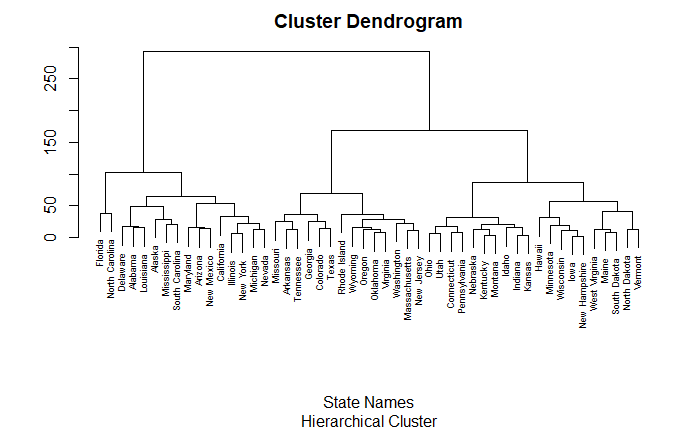
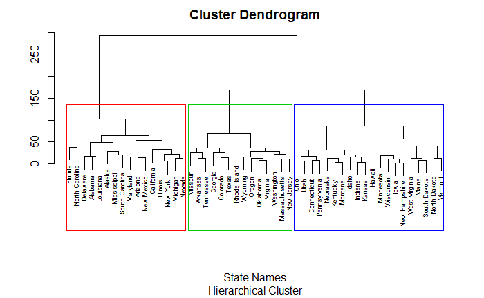
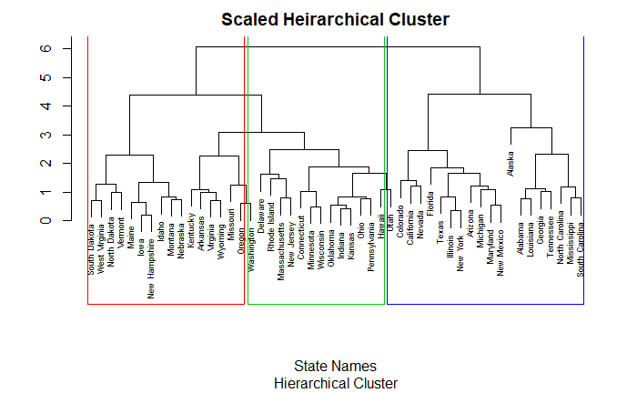

# Using the USArrests dataset in R for Heirarchical Clustering

The aim of this project is to utilize Heirarchical Clustering and Dendogram visualization on the USArrest dataset in R.

First the necessary libraries are imported.

## Dendogram Visualization of H-Clustering

Using the hclust and plot function a dendogram is created showing the euclidean relationship between states:

Next three clusters are identified and mapped onto our plot:

Each state is then identified belonging to each cluster.

## Scaling

Since the data has multiple units (per 100,000 and also as percentages), we want to scale the data and view the difference.
The new dendogram is visualized and all the states belonging to these new clusters is observed:

